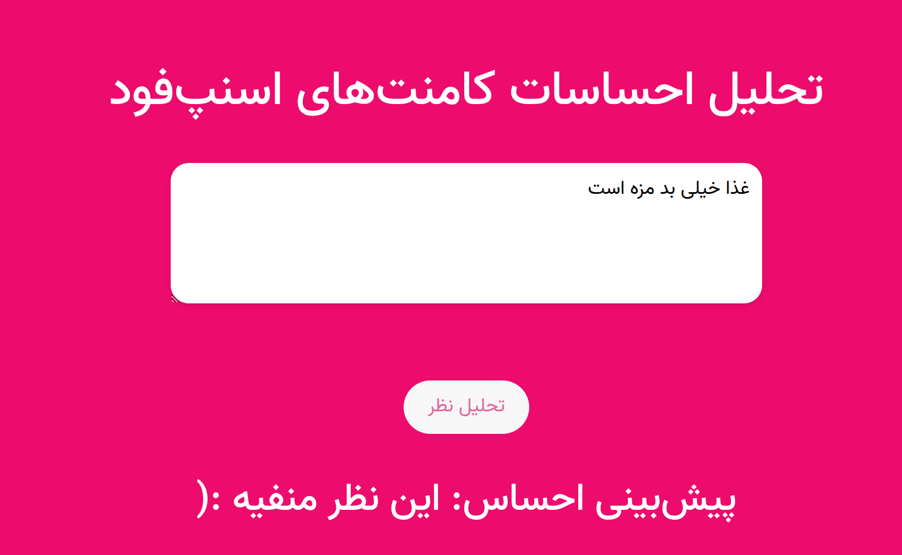

# Sentiment Analysis Flask App

This is a Flask-based web application for Persian sentiment analysis. The app utilizes a custom pre-processing pipeline to clean and prepare input text for a sentiment analysis model, which classifies the input as either positive or negative. The model is deployed in a Docker container for consistency across environments.

## Features

- **Custom Pre-processing Pipeline**: Includes punctuation removal, diacritic removal, normalization, tokenization, stopword removal, and lemmatization using the `hazm` library for classical machine learning models.
- **TensorFlow Pre-processing Pipeline**: Uses TensorFlow's built-in pre-processing for the LSTM model.
- **Real-time Sentiment Prediction**: Users can input Persian text to receive instant sentiment predictions.
- **Flask Web Framework**: The application uses Flask to handle HTTP requests and render the web interface.
- **Dockerized Application**: The app is containerized with Docker, ensuring that it can run reliably in any environment.

## Model Comparison: Classical Machine Learning vs. LSTM

We compared classical machine learning models with an LSTM model. For the classical methods, we applied custom pre-processing techniques such as tokenization, normalization, and feature extraction. In contrast, for the LSTM model, we utilized TensorFlow's built-in pre-processing pipeline. The LSTM model benefited from TensorFlow’s more advanced pre-processing techniques, which led to higher accuracy.

After completing the comparison, we found that the LSTM model outperformed the classical models in terms of accuracy. Below are the test accuracy results for the models:

| Model                    | Test Accuracy |
|---------------------------|---------------|
| NearestCentroid            | 0.777500      |
| KNeighborsClassifier       | 0.682000      |
| DecisionTreeClassifier     | 0.721000      |
| LogisticRegression         | 0.806000      |
| GaussianNB                 | 0.679000      |
| Perceptron                 | 0.598000      |
| SVC                        | 0.810000      |
| RandomForestClassifier     | 0.806500      |
| **LSTM**                   | **0.843929**  |

As the table shows, the LSTM model achieved the best performance, primarily due to the more advanced pre-processing techniques and the model's ability to capture sequential dependencies, which classical models like decision trees or SVM may struggle with.

## How to Run the Application

### 1. Clone the Repository

```bash
git clone https://github.com/parvvaresh/SnappFood
cd SnappFood
```

### 2. Install Dependencies

Make sure you have Python 3.11 installed. Then, create a virtual environment and install the required dependencies.

```bash
python3 -m venv venv
source venv/bin/activate  # On Windows use `venv\Scripts\activate`
pip install -r requirements.txt
```

### 3. Run the Flask Application Locally

After setting up the environment, you can start the Flask application.

```bash
python app.py
```

The application will run locally at `http://127.0.0.1:5000/`.

### 4. Docker Deployment

To ensure that the application runs in any environment, it is containerized using Docker.

#### Steps to Deploy with Docker

1. **Build the Docker Image**

   Run the following command in the root directory to build the Docker image:

   ```bash
   docker build -t sentiment-analysis-flask-app .
   ```

2. **Run the Docker Container**

   Once the image is built, run the Docker container:

   ```bash
   docker run -p 5000:5000 sentiment-analysis-flask-app
   ```

   The application will now be accessible at `http://localhost:5000`.

## Usage

1. Navigate to the homepage (`/`), where you'll find a text input field.
2. Enter your Persian text and click the submit button.
3. The model will classify the input text as either positive or negative, displaying the result on the page.

## Custom Pre-processing Pipelines

### Classical Machine Learning Models

For classical models, the app uses a custom pre-processing pipeline implemented in the `PreProcess.py` module. This pipeline performs the following steps:

- **Punctuation Removal**: Removes both English and Persian punctuations.
- **Diacritics Removal**: Strips Arabic diacritics such as Tashdid, Fatha, and Sukun.
- **Normalization**: Normalizes the text by replacing Arabic and Persian variants of certain characters.
- **Repeating Character Removal**: Collapses repeated characters in the text.
- **Tokenization**: Splits the text into tokens (words).
- **Stopword Removal**: Filters out common Persian stopwords using the `hazm` library.
- **Lemmatization**: Converts words to their base form using the `hazm` Lemmatizer.

### LSTM Model

For the LSTM model, TensorFlow's built-in pre-processing pipeline is used. This includes tokenization, padding, and sequence vectorization, allowing the model to handle sequential dependencies in the text effectively.

## Project Structure

```
.
├── app.py                           # Main Flask application entry point
├── assets                           # Directory for storing model results and visualizations
│   ├── accuracy_model.png           # Accuracy comparison image for models
│   ├── result_dl.txt                # Deep Learning model results
│   └── result_ml.csv                # Machine Learning model results
├── data                             # Data folder containing datasets
│   └── Snappfood.csv                # Sample dataset for the project
├── Dockerfile                       # Docker configuration for containerization
├── final_models                     # Directory for storing the final trained models
│   ├── lstm_model.h5                # Trained LSTM model
│   └── tokenizer.json               # Tokenizer configuration for the LSTM model
├── models                           # Directory containing machine learning models and related files
│   ├── parameter                    # Individual machine learning models and scripts
│   │   ├── decision_tree.py         # Decision Tree model implementation
│   │   ├── knn.py                   # K-Nearest Neighbors model implementation
│   │   ├── logstic_regression.py    # Logistic Regression model implementation
│   │   ├── models.py                # Base models class or helper functions
│   │   ├── naive_bayes.py           # Naive Bayes model implementation
│   │   ├── NearestCentroid.py       # Nearest Centroid model implementation
│   │   ├── perceptron.py            # Perceptron model implementation
│   │   ├── random_forest.py         # Random Forest model implementation
│   │   └── svm.py                   # Support Vector Machine (SVM) model implementation
│   ├── parameter_finder.py          # Script to find optimal model parameters
│   ├── train_dl_model.py            # Script to train the Deep Learning (LSTM) model
│   └── train_MLmodels.py            # Script to train classical Machine Learning models
├── pipeline_predict.py              # Pipeline for text preprocessing and model prediction
├── PreProcess.py                    # Custom text pre-processing class for Persian language
├── __pycache__                      # Directory containing compiled Python files
│   └── pipeline_predict.cpython-311.pyc  # Compiled pipeline_predict.py file
├── requirements.txt                 # List of Python dependencies for the project
├── run_models.py                    # Script to run and evaluate multiple models
├── static                           # Static files like CSS, JavaScript
│   └── style.css                    # Custom CSS file for web styling
└── templates                        # HTML templates for Flask web interface
    └── index.html                   # Main HTML file for the web interface

10 directories, 37 files
```

## Model Prediction

The prediction logic is handled by the `pipeline_predict.py` module. It processes the user input using the custom pre-processing pipeline (for classical models) or TensorFlow's pre-processing pipeline (for the LSTM model) and then passes it to the pre-trained sentiment analysis model to predict whether the input sentiment is positive or negative.

## Requirements

- Python 3.11
- Flask
- hazm
- TensorFlow or any other machine learning framework you use for your model


## Web App



## License

This project is licensed under the MIT License.

## Contact

For any inquiries, feel free to contact the project maintainer at [parvvaresh@gmail.com].
```
